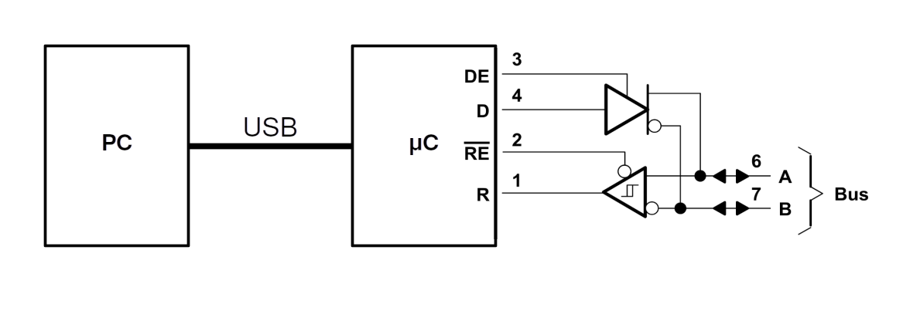

# Computer Networks Project
## Overview
TODO(Barach):
## Scope
| Layer       | Responsibility                                      | Implementation   |
|-------------|-----------------------------------------------------|------------------|
| Application | TODO(Barach)                                        | PC Software      |
| Transport   | Reliable transmission, flow control                 | PC Software      |
| Network     | Device addressing, bus arbitration, error detection | Adapter Firmware |
| Data Link   | Data framing, clock synchronization                 | UART             |
| Physical    | Bit encoding, bus states                            | CAN-PHY          |

## Hardware
In order to interface with the network, a PC must utilize a custom hardware adapter. Each adapter contains a RPI Pico
microcontroller and a CAN transceiver. The microcontroller is responsible for implementing the network and data-link layers,
while the transceiver implements the physical layer.

